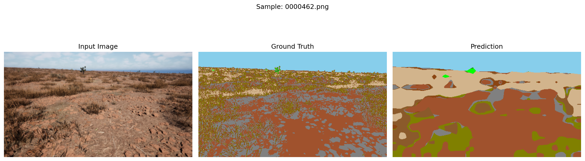
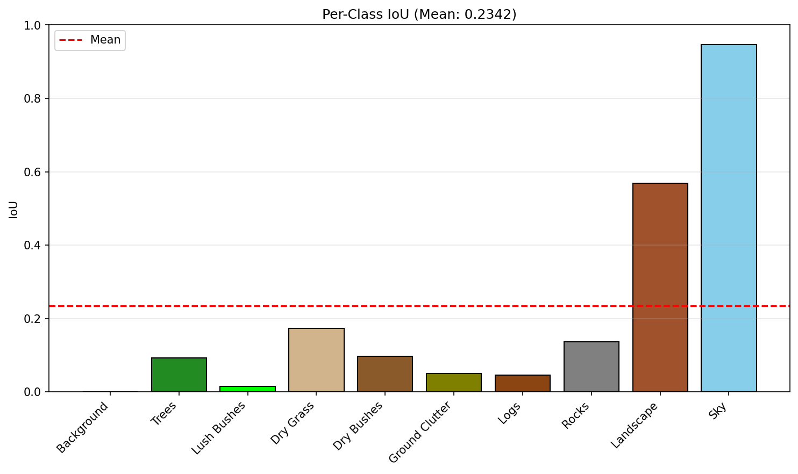

# Offroad Autonomy Semantic Segmentation


Built for the Duality AI Hackathon, this project develops a robust computer vision pipeline for autonomous Unmanned Ground Vehicles (UGVs) navigating complex, unstructured desert environments. 

Collecting and manually labeling real-world offroad data presents significant safety and financial bottlenecks. To bypass this, our model is trained entirely on high-fidelity synthetic data generated via Duality AI's Falcon digital twin platform.

## Architecture
* **Feature Extractor:** [DINOv2](https://dinov2.metademolab.com/) (Meta/Facebook Research) utilized as a foundational vision transformer for robust feature extraction.
* **Segmentation Head:** A custom ConvNeXt-style convolutional network designed to map DINOv2 embeddings into 10 distinct environmental classes (e.g., Lush Bushes, Dry Grass, Ground Clutter, Rocks).

---

## Repository Structure

    .
    ├── Makefile                # Automation commands for setup, training, and testing
    ├── README.md               # Project documentation
    ├── docs/                   # Typst documentation and project report
    ├── data/                   # Dataset directory (generated via Makefile)
    │   ├── train/
    │   ├── val/
    │   └── testImages/
    └── src/                    # Source code
        ├── train.py            # Model training script
        ├── test.py             # Inference and metric evaluation script
        └── visualize.py        # Utility to colorize raw segmentation masks

---

## Environment Setup

This project utilizes a `Makefile` to streamline deployment. It can be executed via Google Colab or locally. 

### Option A: Google Colab (Recommended)
Colab provides pre-configured dependencies and free GPU access. 
1. Upload this repository to your Google Drive and open a new Colab Notebook in the root directory.
2. Enable a GPU runtime (`Runtime` > `Change runtime type` > `T4 GPU`).
3. Run the following commands to configure the environment and fetch the data:
   ```bash
   !make setup
   !make get-data
   ```

### Option B: Local Machine Deployment
If deploying locally, **a virtual environment is strictly required** to prevent dependency conflicts. 

**Using Conda:**
```bash
conda create -n duality_env python=3.10
conda activate duality_env
make setup
make get-data
```

**Using Python Venv:**
```bash
python -m venv venv
source venv/bin/activate  # On Windows: venv\Scripts\activate
make setup
make get-data
```

---

## Execution Pipeline

Ensure `make get-data` has successfully downloaded and extracted the datasets before proceeding.

### 1. Model Training
Train the ConvNeXt segmentation head over the DINOv2 backbone (default: 10 epochs):
```bash
make train
```
*Outputs:* Saves the trained weights to `src/segmentation_head.pth` and exports performance graphs to the `train_stats/` directory.

### 2. Inference and Evaluation
Execute inference on the validation dataset and compute Intersection over Union (IoU) and Dice scores:
```bash
make test
```
*Outputs:* Generates raw class masks, RGB-colorized masks, and side-by-side comparative visualizations in the `predictions/` directory.

### 3. Mask Visualization
Utility to convert raw, low-value segmentation mask matrices into high-contrast RGB images for visual inspection:
```bash
make visualize
```

---

## Results and Metrics

Our model evaluates pixel-level classifications against the digital-twin ground truth. Below are comparative visualizations of the input, ground truth, and predicted segmentation on unseen data.

**Sample Prediction 1:**


### Training Metrics
The model's performance and generalizability were quantified using the Intersection over Union (IoU) metric across all 10 designated classes.



---
*Developed by [Team Safaris] for the Hack the Night Hackathon.*
